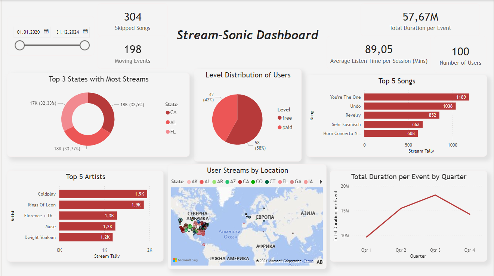

# Real-time Data Pipeline for Music Streaming Analytics

## Description

This project simulates a real-time music streaming service (similar to Spotify), collecting, processing, and analyzing streaming data to gain insights into user behavior and preferences.  
It includes the design, implementation, and orchestration of a scalable data pipeline for processing high volumes of event-based data in real-time.

### Key Features:
- **Real-time data processing** to analyze streaming events as they occur.
- **Simulated music streaming service** to mimic user interactions (song plays, skips, etc.).
- **Scalable data pipeline** to handle large volumes of event-based data.
- **User behavior analysis** and insights into preferences based on streaming activity.
- **Integration with popular tools** like Kafka, Spark Streaming, GCP, and Power BI for data processing and visualization.

## Objectives
- **Architecture Design:** Develop and design a scalable, efficient, and fault-tolerant architecture for processing streaming data.
- **Stream Simulation:** Generate synthetic user activity data to simulate the streaming service (e.g., song plays, skips, and session details).
- **Real-time Data Processing:** Leverage Kafka and Spark Streaming for processing real-time data streams.
- **Data Transformation and Storage:** Utilize dbt for data transformation and store data in Google Cloud Storage and BigQuery for further analysis.
- **Workflow Orchestration:** Employ Apache Airflow to manage data pipeline workflows and automate tasks.
- **Data Visualization:** Build interactive dashboards in Power BI.

